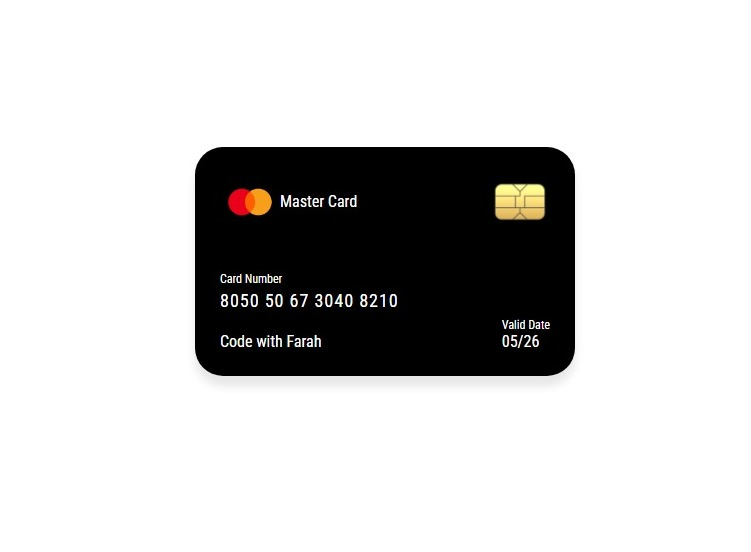

# 💳 MasterCard Design (HTML & CSS)

This project is a **MasterCard design layout** created using **HTML** and **CSS**.  
It is **fully responsive** and adjusts beautifully on desktop, tablet, and mobile screens.  
The design includes **3 images** to enhance the card UI.  

---

## 📸 Screenshots

  
  
  
  

---

## 🚀 Features
- Built with **HTML & CSS** only  
- **Responsive design** (works on desktop, tablet & mobile)  
- Clean and modern layout  
- Uses 3 images (background, chip, logo) for realistic card UI  
- Includes a card screenshot for preview  
- Easy to customize  


---

## 🛠️ Technologies Used
- **HTML5**  
- **CSS3**  

---

## 📂 Project Structure
```bash
├── index.html        # Main HTML file
├── style.css         # CSS styling and responsiveness
└── images
    ├── bg-img.jpeg
    ├── chip-img.png
    └── logoimg1.png
    └── credit-screenshot.jpeg


## 🔧 How to Use
1. Clone this repository:
   ```bash
   git clone https://github.com/Farah-Saleem270/Creditcardrepo
   ```
2. Open the project folder:
   ```bash
   cd Creditcardrepo
   ```
3. Run `index.html` in your browser.  
4. Resize the browser window to check responsiveness.


## 👩‍💻 Author
Created with ❤️ by **Farah Saleem**  
GitHub: [Farah-Saleem270](https://github.com/Farah-Saleem270)